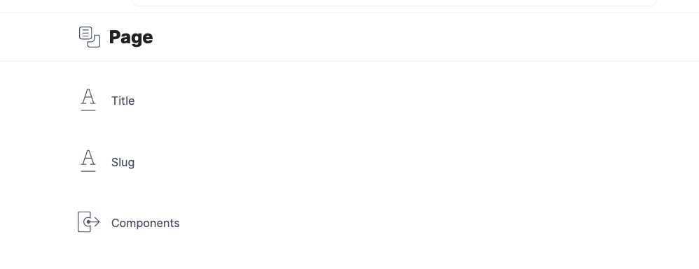
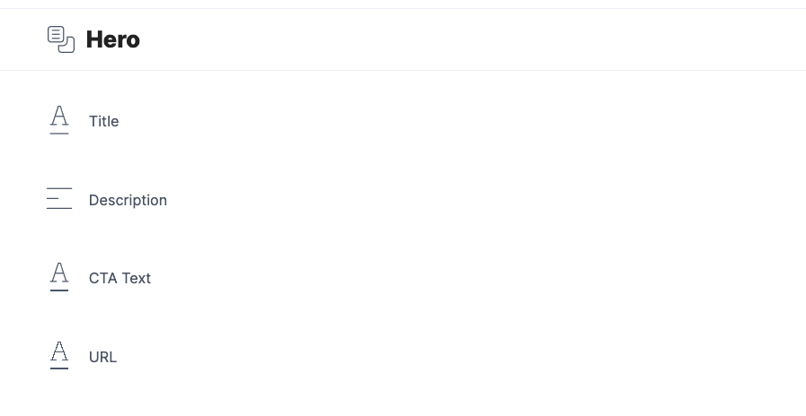

# Contentstack + SvelteKit + Tailwind CSS

Example project using SvelteKit with the [Contentstack Delivery API](https://www.contentstack.com/docs/developers/apis/content-delivery-api/), deployed to [Vercel](https://vercel.com).


_Live Example: https://contentstack-svelte.vercel.app/_

_Live Example: https://contentstack-svelte.vercel.app/test_

## Developing

### Env variables

Remember to set up a `.env` file with your contentstack keys

```env
VITE_CONTENTSTACK_STACK_API_KEY=''
VITE_CONTENTSTACK_ENVIRONMENT=''
VITE_CONTENTSTACK_DELIVERY_TOKEN=''
VITE_CONTENTSTACK_REGION=''
```

Once you've created a project and installed dependencies with `npm install`, start a development server:

```bash
npm run dev

# or start the server and open the app in a new browser tab
npm run dev -- --open
```

## Building

This uses the [Vercel Adapter](https://github.com/sveltejs/kit/tree/master/packages/adapter-vercel) for SvelteKit.

```bash
npm run build
```

## Content types
This starter kit relies on the following content models.

### Page

* Title, short text.
* Slug, short text
* Components, References - many.

### Hero

* Title, short text.
* Description, short text
* CTA Text, short text
* URL, short text
